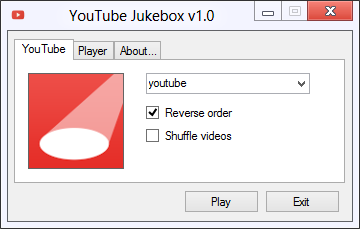
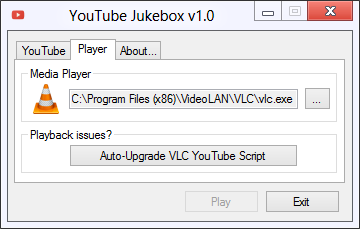

# YouTube Jukebox
Easy playback of YouTube channels - Inspired by [youtube.nestharion.de](http://youtube.nestharion.de).

## Overview

This app allows retrieving all the videos from a YouTube user and playing them with the specified media player:

   

VLC is the recommended media player, and a built-in feature allows to upgrade its YouTube playback script.
You may use any other media player of your choice that handles m3u playlists containing YouTube URLs.

## Command-Line usage

If running Mac or Linux, you might prefer the command-line usage:
````
mono YouTubeJukebox.exe <YouTube channel>
````
This will output the list of video URLs to standard ouput.

See `mono YouTubeJukebox.exe --help` for a list of allowed arguments

## How it works

This app does not make use of any YouTube API, to avoid weird limitations and the requirement of an API key.
Profile picture and video list are retrieved from the regular web interface hosted at the following URL:

````
https://www.youtube.com/user/<Username>/videos
````

The first time a channel is played, the whole video list is fetched,
which may take a few minutes if the channel contains a huge amount of videos.
Once done, a cache of last viewed channels is maintained for faster loading times.

After applying modifiers eg reverse or shuffle, a m3u playlist file is created, containing a list of URLs.
The playlist file is then passed to the media player, which will take care of playing the videos.

As some changes on YouTube may break video playback,
the [playback script](https://github.com/videolan/vlc/blob/master/share/lua/playlist/youtube.lua)
of the VLC media player is updated from time to time, so the upgrade script feature
allows to easily update your VLC installation with the latest script.

Also, some changes on the web interface may break video retrieval, so if this app does not work anymore,
a fix for me and an update for you will be required. That's the downside of not using an official API ;)

## License

YouTube Jukebox is provided under
[CDDL-1.0](http://opensource.org/licenses/CDDL-1.0)
([Why?](http://qstuff.blogspot.fr/2007/04/why-cddl.html)).

Basically, you can use it or its source for any project, free or commercial, but if you improve it or fix issues,
the license requires you to contribute back by submitting a pull request with your improved version of the code.
Also, credit must be given to the original project, and license notices may not be removed from the code.
